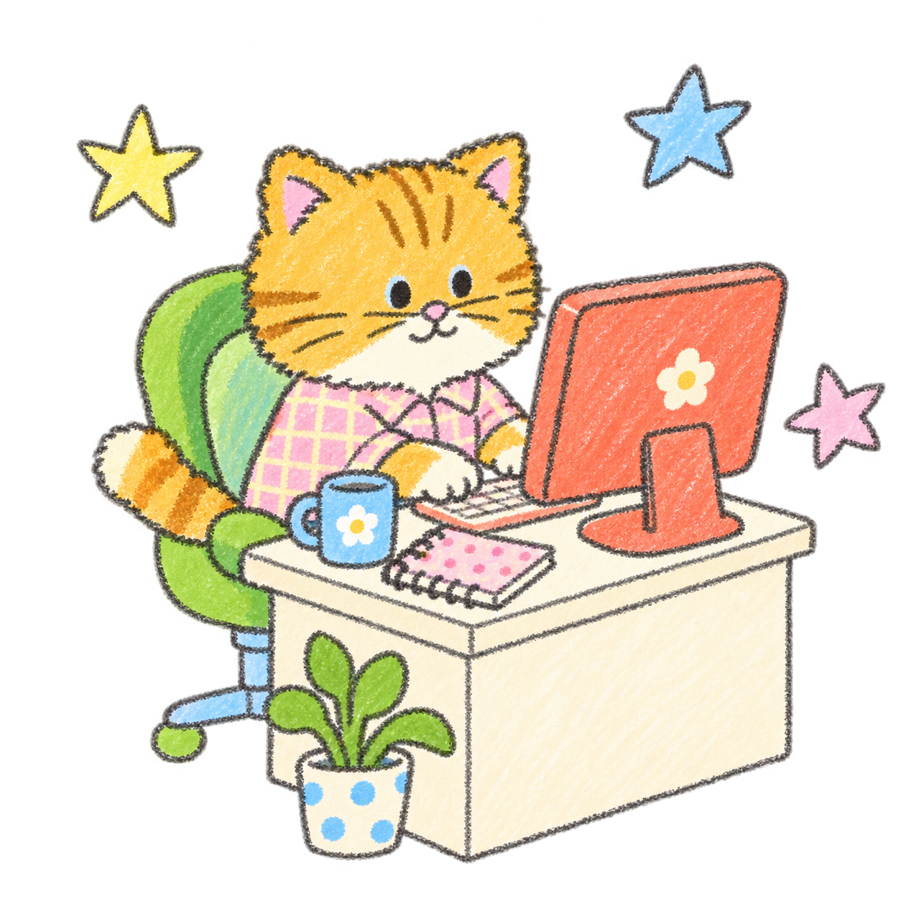
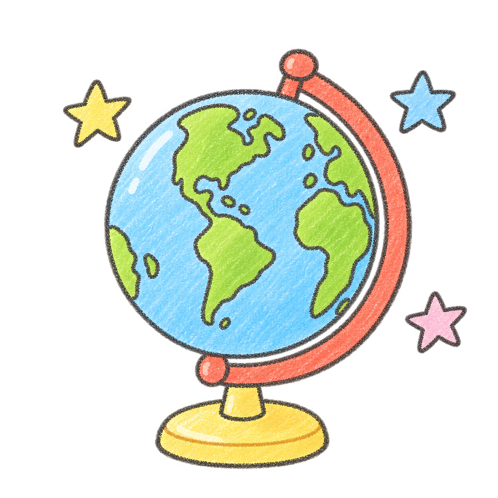

<h1>Hi friends! I'm Chloe! 👋</h1>

<strong>Creating through language, AI & curiosity.</strong>

  I’m a creator who loves building products that help people
  live more fully in the present and feel more connected—to
  the world and to themselves.

  LANGUAGE · AI · PHILOSOPHY · HUMAN CONNECTION

 

<h3>
  
  A little more about me
</h3>

  
My curiosity, philosophy & approach to creating

  

    My love for philosophy and my fascination with the human
    condition keep me endlessly curious about the world and
    all the possibilities within it.
  

  

    I have a sensitive heart that works almost like a magnifying
    glass, allowing me to notice the smallest things and find
    something profound in them.
  

  

    Through language and AI, I imagine and create new ways for
    people to feel the beauty of their own existence, even in
    a world as vast as ours—to reconnect with themselves,
    experience life more deeply, and see the world through a
    more authentic first-person lens.
  

